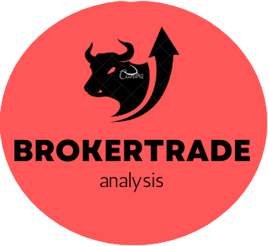
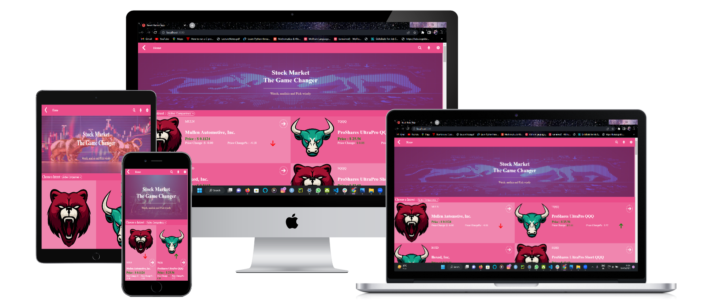
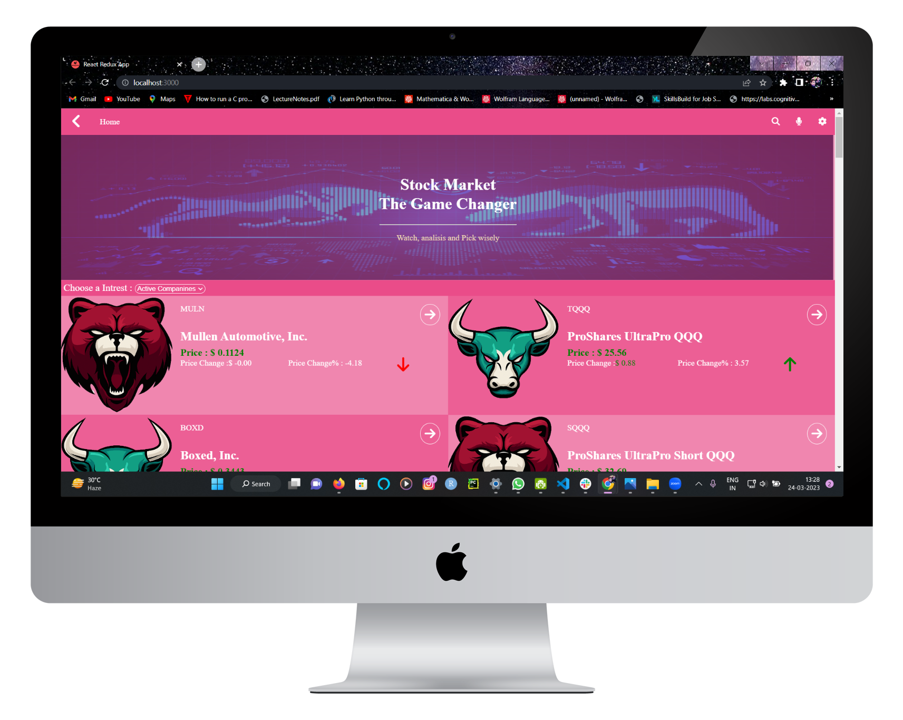

  
  
   
  <h1><b>Stock Market Analysis</b>  </h1>
 

  <h1>App Mock</h1>
  
  

 
 
 
<!-- TABLE OF CONTENTS -->

# 📗 Table of Contents

- [📖 About the Project](#about-project)
  - [🛠 Built With](#built-with)
    - [Tech Stack](#tech-stack)
    - [Key Features](#key-features)
  - [🚀 Live Demo](#live-demo)
- [💻 Getting Started](#getting-started)
  - [Setup](#setup)
  - [Prerequisites](#prerequisites)
  - [Install](#install)
  - [Usage](#usage)
  - [Run tests](#run-tests)
  - [Deployment](#triangular_flag_on_post-deployment)
- [👥 Authors](#authors)
- [🔭 Future Features](#future-features)
- [🤝 Contributing](#contributing)
- [⭐️ Show your support](#support)
- [🙏 Acknowledgements](#acknowledgements)
- [🧑‍💻 Credits ](#credit)
- [📝 License](#license)

<!-- PROJECT DESCRIPTION -->

# 📖 Stock Market Analysis 

> This Project is a for Stock Market Analysis and to compare various stock performance

**Stock Market Analysis** This is a React-Based Project, in this website you can analyze your stocks and compare them to optimize your profit, it works with the financial API, and apart from this you will find a responsive design and clean UI, and in the future maybe we have some more features for checking bitcoin and searching company stock by name and a detailed navigation bar

 

## 🛠 Built With 

### Tech Stack 

> In this project I used many skills, tech and libraries

  
Documentation

  <ul>
    <li><a href="https://html.com">HTML</a></li>
  </ul>

  
Styling

  <ul>
    <li><a href="https://www.w3.org">CSS</a></li>
  </ul>

Dynamics And Logics

  <ul>
    <li><a href="https://www.reactjs.org">React</a></li>
  </ul>

API involved

  <ul>
    <li>Financial Modeling</li>
  </ul>

 

<!-- Features -->

### Key Features 

> Following features you should observe

- **you can see the stock bulling and Bearing**
- **You can  see the **active companies **in** the ****** market****
- **you can see short and full **details of **a **specific**** company****

(<a href="#readme-top">back to top</a>)

<!-- LIVE DEMO -->

## 🚀 Live Demo 

> This link will guide you to my project

presentation video <a href="https://www.loom.com/share/aed6644a3829491ca4d69c45f222d2ab">click here </a>

(<a href="#readme-top">back to top</a>)

<!-- GETTING STARTED -->

## 💻 Getting Started 

>For having local file and project you can fork this repo 

>And for making changes you you should follow prerequisites

### Prerequisites
To edit this project you need:
 - Node.js installed
 - A Terminal 
 - A web browser
 - An IDE

 - suggested IDE
   - visual studio code
   - atom 
   - visual code 

### Setup

Clone this repository to your desired folder:

 - And run `npm i` in root dir <small>to install node modules</small>
 - Then run `npm run dev` or `npm start`
 - All this makes our project open  in the browser

### Usage

 Execute the following thing:
 
 - Stocks and State is manipulated by API 
 - details page with proper logo

### Run tests

- To run all test cases you need to run `npm test` in the root dir 
- Linters for files run in the root dir
  - `npx eslint "**/*.{js,jsx}` for JS or JSX linting
  - `npx stylelint "**/*.{css,scss}"`for CSS or SCSS linting
  - `npx hint .` for HTML linting
  - `--fix` flag for instant fixable fix
 

### Deployment

You can deploy this project using:
- Fork our Repo and clone it or download `zip` and extract it
- Edit some changes
- Run `npm run build` to make our project production ready
- deploy it using [GitHub](www.github.com) pages 
- or use Netlify or Render
 

(<a href="#readme-top">back to top</a>)

<!-- AUTHORS -->

## 👥 Authors 

👤 **Adarsh Pathak**

- GitHub: [@PowerLevel9000](https://github.com/githubhandle)
- Twitter: [@PowerLevel9002](https://twitter.com/PowerLevel9002?t=AIuSN7mTxk5a_MWpLolEjA&s=09)
- LinkedIn: [@Adarsh Pathak](https://www.linkedin.com/in/adarsh-pathak-56a831256/)

<!-- FUTURE FEATURES -->

## 🔭 Future Features 

> Describe 1 - 3 features that will add to the project.

- [ ] **Search Feature**
- [ ] **Crypto filter**
- [ ] **Indicators of the stock market**

(<a href="#readme-top">back to top</a>)

<!-- CONTRIBUTING -->

## 🤝 Contributing 

Contributions, issues, and feature requests are welcome!

Feel free to check the [issues page](https://github.com/PowerLevel9000/stock-market/issues).

(<a href="#readme-top">back to top</a>)

<!-- SUPPORT -->

## ⭐️ Show your support 

If you like my Project give it a Star ✨🌟 

(<a href="#readme-top">back to top</a>)

## credit 
The credit for the <a href="https://www.behance.net/gallery/31579789/Ballhead-App-(Free-PSDs)"> design</a> goes to <a href="https://www.behance.net/sakwadesignstudio">nelson sakawa</a>

(<a href="#readme-top">back to top</a>)

<!-- LICENSE -->

## 📝 License 

This project is [MIT](https://github.com/PowerLevel9000/stock-market/blob/dev/LICENSE) licensed.

(<a href="#readme-top">back to top</a>) 

